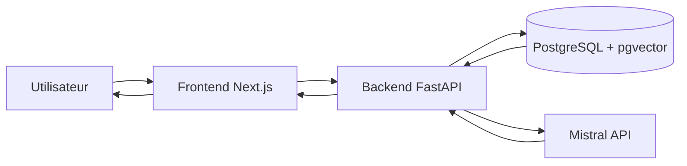
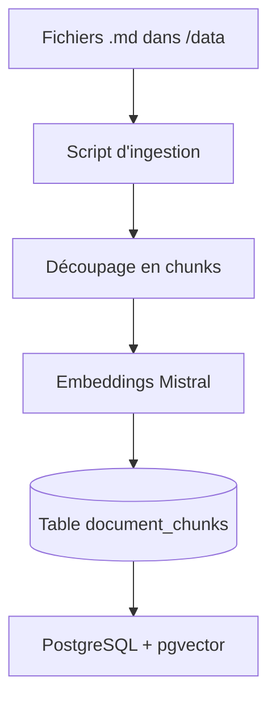
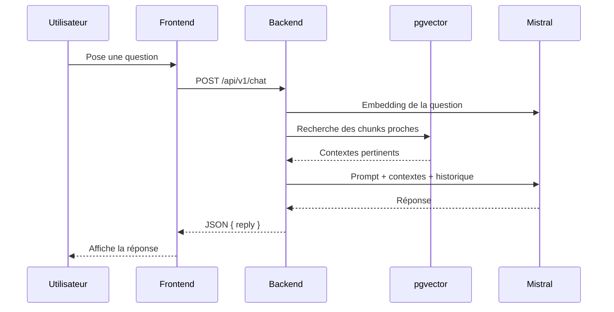
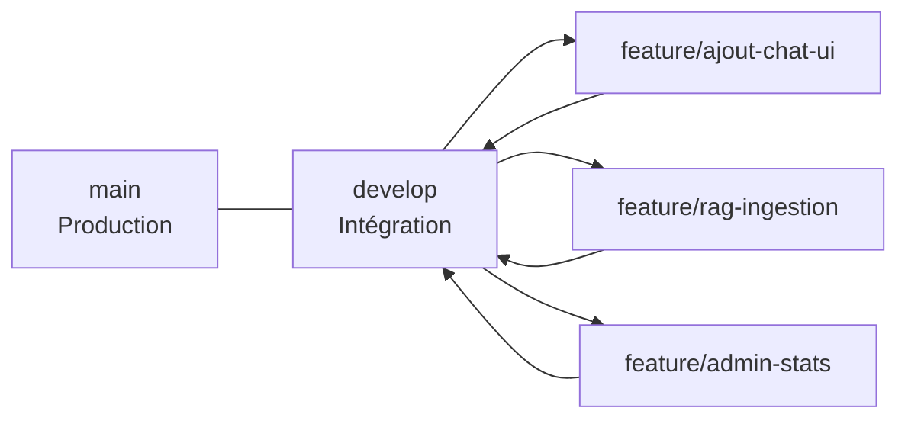
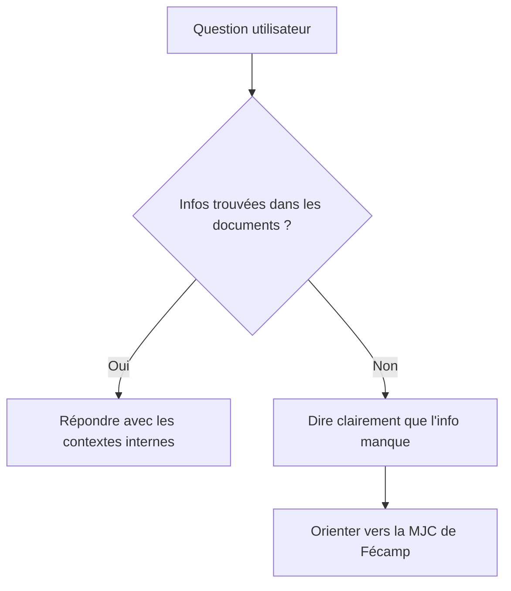

# Chatbot Diagrams (Mermaid)

Ces schémas servent à vulgariser le fonctionnement actuel du projet.

## 1) Vue globale (architecture)

## 2) Cycle d’ingestion des données (`make dev-data`)

## 3) Cycle de réponse (RAG simplifié)

## 4) Stratégie des branches Git (contribution)

## 5) Logique métier “réponse encadrée”

