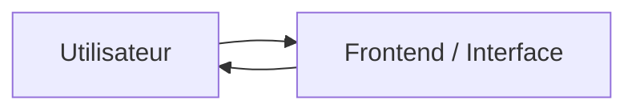
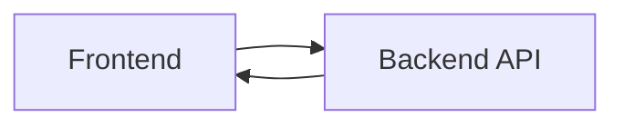
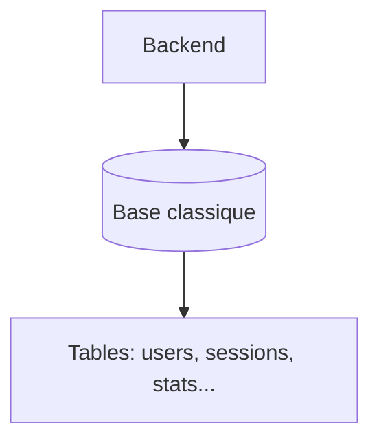
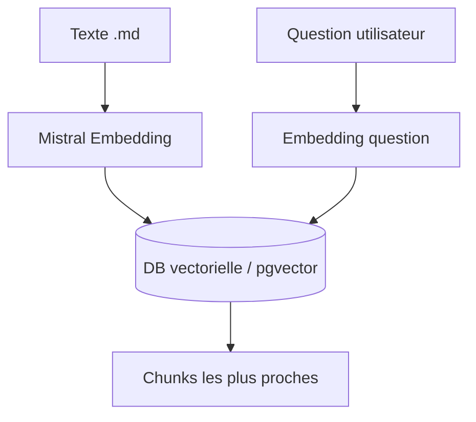
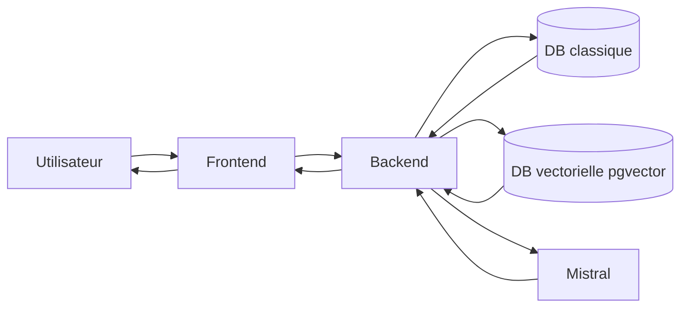

# Concepts simples (avec schémas)

Ce document explique des notions de base du projet avec des mots simples.

## 1) Frontend — c'est quoi ?

Le **frontend**, c'est la partie visible par l'utilisateur :
- la page web,
- les boutons,
- le champ de saisie,
- l'affichage des messages du chatbot.

Dans ce projet, le frontend est en **Next.js**.

**Image mentale :** c'est la vitrine et le comptoir d'accueil.

---

## 2) Backend — c'est quoi ?

Le **backend**, c'est la partie "coulisses" :
- reçoit les requêtes du frontend,
- applique les règles métier,
- appelle la base de données,
- appelle le LLM (Mistral),
- renvoie une réponse.

Dans ce projet, le backend est en **FastAPI**.

**Image mentale :** c'est l'équipe interne qui traite la demande.

---

## 3) Base de données classique — c'est quoi ?

Une base classique (ex: **PostgreSQL**) stocke des données structurées :
- utilisateurs,
- activités,
- dates,
- logs,
- statistiques.

On interroge souvent avec des conditions exactes :
`id = 12`, `date > ...`, `email = ...`.

**Image mentale :** un classeur bien organisé avec des colonnes.

---

## 4) Base de données vectorielle — c'est quoi ?

Une base vectorielle stocke des **vecteurs** (listes de nombres) qui représentent le **sens** d'un texte.

Exemple :
- phrase: "cours de danse le mardi"
- embedding: `[0.12, -0.33, 0.88, ...]`

Quand l'utilisateur pose une question, on vectorise la question puis on cherche les textes les plus proches en sens.

Dans ce projet, c'est PostgreSQL + **pgvector**.

**Image mentale :** un moteur "recherche par sens", pas juste par mot exact.

---

## 5) Frontend + Backend + DB + Vector DB (ensemble)

Résumé :
- **Frontend** = ce que l'utilisateur voit
- **Backend** = logique et orchestration
- **DB classique** = données structurées du produit
- **DB vectorielle** = recherche sémantique pour le RAG
